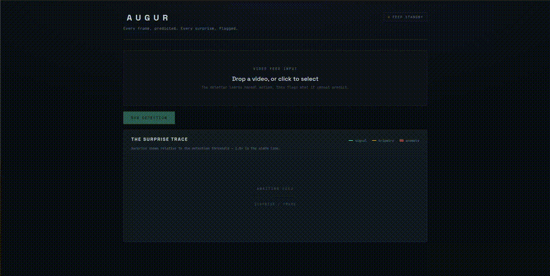
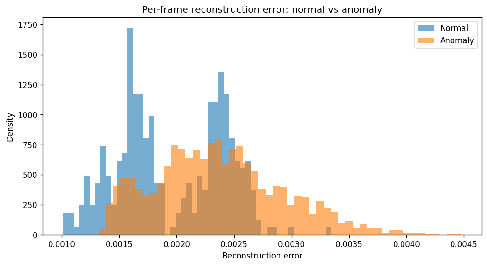
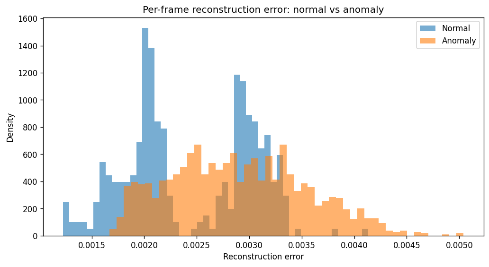
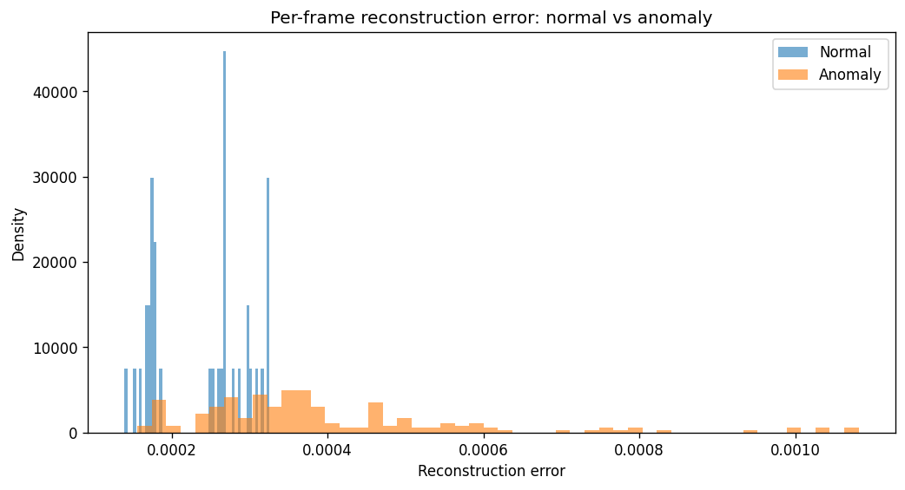
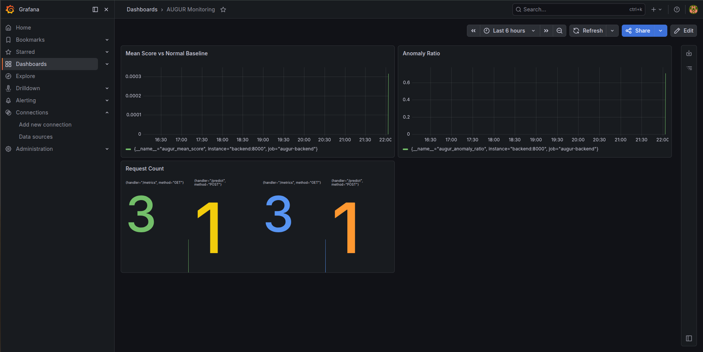

# AUGUR — Predictive Video Anomaly Detection

**Every frame, predicted. Every surprise, flagged.**

A real-time video anomaly detector that learns what *normal* motion looks like,
then flags the moments it cannot predict — built end-to-end from a research
baseline to a deployed, monitored service.

[**▶ Live demo**](https://huggingface.co/spaces/e-cagan/SPACE) · [Engineering log](docs/milestones.md)



---

## The core finding

The interesting result of this project is not a single number — it's a
controlled comparison of three anomaly-detection paradigms on the same data,
with the same protocol:

| Paradigm | Model | Frame-level AUC | EER |
|---|---|---|---|
| Reconstruction (vanilla) | 3D conv autoencoder | 0.701 | 0.391 |
| Reconstruction (memory) | Memory-augmented AE (MemAE) | 0.688 | 0.436 |
| **Prediction** | **U-Net future-frame predictor** | **0.840** | **0.279** |

Reconstruction-based detection stalled at ~0.70 AUC: the model reconstructs
anomalies almost as well as normal frames (over-generalization). Adding a
*stronger* reconstruction model (MemAE) did **not** help — a documented negative
result. The fix was not more capacity but a **different paradigm**: instead of
reconstructing the present frame, predict the *next* one. Anomalies are, by
definition, unpredictable — so prediction error separates normal from anomalous
far better (+14 AUC points, EER nearly halved).

> The bottleneck was the paradigm, not the model. Measuring that — baseline →
> honest negative result → paradigm fix — is the project's main contribution.

The error distributions tell the same story visually — normal vs. anomalous
score overlap shrinks as the paradigm changes:

| Reconstruction (M1) | Memory (M2) | Prediction (M3) |
|---|---|---|
|  |  |  |
| overlapping | still overlapping | clearly separated |

---

## How it works

The deployed model is a **2D U-Net** that takes the last 15 grayscale frames
(channel-stacked) and predicts the next one. At inference, each incoming frame is
scored by the mean-squared error between the model's prediction and the actual
frame. High prediction error = the scene did something the model didn't expect =
anomaly.

- **Trained on normal clips only** (self-supervised — no anomaly labels in
  training), on the UCSD Ped2 pedestrian-walkway dataset.
- **Threshold calibrated** from the normal-frame score distribution
  (mean + 2·std = 0.000291), chosen by comparing precision/recall on the test
  split (favoring recall — not missing anomalies — for a monitoring use case).
- **Localization** via the per-pixel prediction-error heatmap, overlaid on the
  frame to show *where* the surprise occurred (this is prediction-error
  localization, not object detection).

---

## The application

A single FastAPI service serves both the inference API and a React/Vite
frontend ("AUGUR" — a surveillance-instrument console):

- **The Surprise Trace** — the anomaly score over time as a seismograph-style
  reading, with the calibrated threshold as an amber "tripwire" line and
  contiguous anomalies as glowing alarm bands. Scores are shown relative to the
  threshold (1.0× = alarm line); raw values are in the tooltip.
- **Synced playback** — the trace draws in sync with the uploaded video; a live
  readout shows the current frame's surprise level and status.
- **Most anomalous moments** — the top-5 highest-scoring frames as
  heatmap-over-frame overlays.

---

## Performance

| Metric | Value |
|---|---|
| Frame-level AUC (Ped2) | 0.840 |
| EER | 0.279 |
| Inference latency (per frame, ONNX-CPU) | 16.9 ms |
| Throughput | 59 fps (~6× real-time) |
| PyTorch ↔ ONNX parity (max abs diff) | 6.5e-07 |

Inference runs on **ONNX-CPU** — no GPU required. At 59 fps versus the video's
10 fps, the detector is comfortably real-time on a single CPU core.

---

## Stack

- **Model:** PyTorch (training) → ONNX Runtime (serving)
- **Backend:** FastAPI, OpenCV (video decode), NumPy, Matplotlib (heatmaps)
- **Frontend:** React, Vite, Recharts
- **MLOps:** Docker + Docker Compose, Prometheus + Grafana (monitoring),
  MLflow (model registry)
- **Deployment:** Hugging Face Spaces (single combined Docker image)

---

## Run it

### Live
The hosted demo: **https://huggingface.co/spaces/e-cagan/SPACE**
(Free-tier Space — the first request after idle wakes the container and may take
a few seconds.)

### Full stack locally (with monitoring)
Brings up the app, Prometheus, and Grafana:

```bash
docker compose -f docker/docker-compose.yml up --build
```

- App: http://localhost:8080
- Prometheus: http://localhost:9090
- Grafana: http://localhost:3000 (admin / admin)

### Deployment image (app only, single container)
```bash
docker build -f docker/Dockerfile.deploy -t augur-deploy .
docker run -p 7860:7860 augur-deploy   # http://localhost:7860
```

---

## Monitoring & registry

The full MLOps stack runs locally via Compose (it is intentionally *not*
deployed — the live demo is the app itself):



- **Prometheus + Grafana** track three signals that matter for this system:
  anomaly ratio per video, mean score vs the calibrated normal baseline (a drift
  signal), and request throughput.
- **MLflow** registers the model (`augur-anomaly-detector v1`) with its metrics,
  parameters, threshold calibration, and ONNX artifact — closing the loop from
  model to metrics to deployment.

---

## Project structure

```
src/
  data/        UCSD loader (reconstruction + prediction modes), transforms
  models/      autoencoder (M1), memory_ae (M2), predictor (M3 — deployed)
  training/    trainer, losses
  inference/   stream (rolling-buffer scoring), scoring
  eval/        metrics (AUC/EER), visualization
  export/      ONNX export + parity check
backend/       FastAPI app (API + static frontend)
frontend/      React/Vite UI
docker/        Dockerfiles, compose, Prometheus/Grafana config
scripts/       train / evaluate / calibrate_threshold / register_model / benchmark
docs/          milestones.md (full M1→M6 engineering log), histograms
```

---

## Honest notes & limitations

- **Dataset scope:** UCSD Ped2 (small, appearance-dominated). Results are
  specific to this setting; the 0.840 AUC uses a minimal loss (intensity +
  gradient), without the optical-flow and adversarial terms from the original
  paper that push published Ped2 numbers to ~0.95.
- **Threshold selection** used the test split for the 2σ-vs-3σ choice (the
  validation set contains no anomalies). This carries mild test bias — a
  pragmatic necessity, documented.
- **Heatmap = prediction-error localization, not object detection.** Bright
  regions mean "unexpected motion here," not "object X detected."
- **Cold start:** the streaming model needs 15 frames before it can score, so
  the first 15 frames of any video are unscored (flagged, not silently zeroed).

### Future work
Optical-flow and adversarial loss terms; true WebSocket streaming; ShanghaiTech
dataset extension; shared ONNX session for higher production throughput.

---

## The engineering story

The full milestone-by-milestone log — including the negative results, the
calibration decisions, and the deployment trade-offs — is in
[`docs/milestones.md`](docs/milestones.md). It documents the project the way it
actually unfolded: a measured baseline, an honest negative result, a paradigm
shift that worked, and the path from a checkpoint to a live service.

---

## License

Released under the [MIT License](LICENSE).